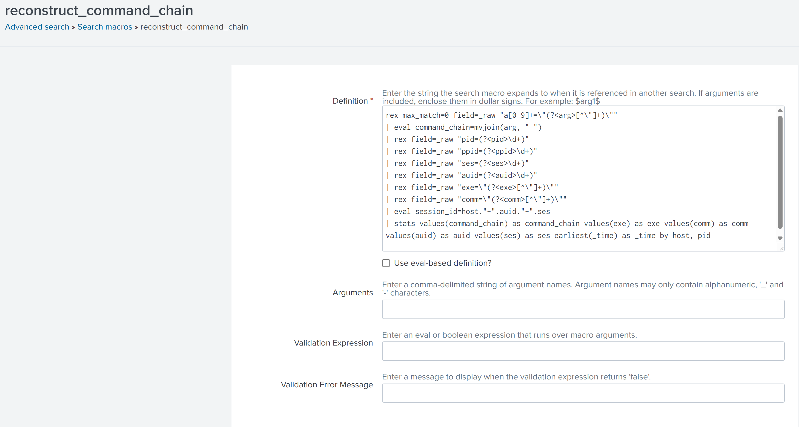
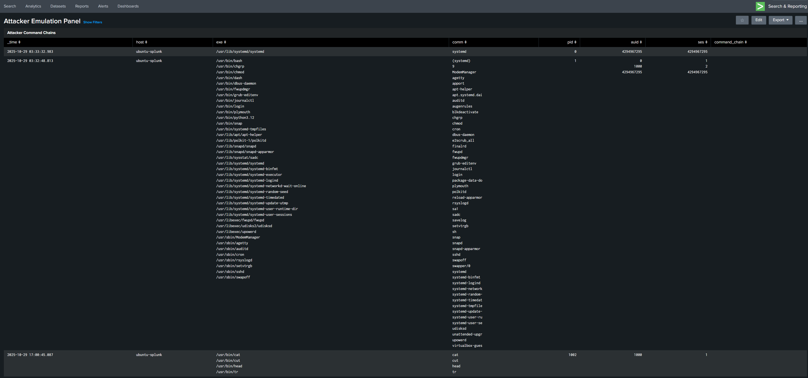

# 🛡️ Realistic Attacker Emulation with Layered Detection Logic

This project reconstructs attacker command chains from fragmented Linux audit logs using Splunk macros, regex extraction, and forensic-grade aggregation. It supports modular dashboards, session-aware correlation, and realistic emulation of adversary behavior.

---

## 🔧 Components

- **Auditd Rules**: Custom rules for capturing `EXECVE` and `SYSCALL` events
- **Splunk Macro**: `reconstruct_command_chain` parses and joins fragmented audit events
- **Dashboard Panel**: Visualizes attacker command chains with metadata
- **Sample Logs** *(optional)*: Anonymized auditd logs for testing and validation

---

## 🧰 Tools Used

| Tool / Platform        | Version / Details                     | Purpose                                                                 |
|------------------------|----------------------------------------|-------------------------------------------------------------------------|
| **Ubuntu Server**      | 22.04 LTS                              | Splunk ingest VM and auditd log source                                  |
| **Kali Linux**         | 2023.4                                 | Attacker emulation host and log generator                               |
| **auditd**             | 3.0.9                                  | Linux auditing framework for syscall and command tracking               |
| **Splunk Enterprise**  | 9.2.0                                  | Log ingestion, parsing, and dashboard visualization                     |
| **TA-linux_auditd**    | 1.0.0                                  | Splunk Technology Add-on for parsing auditd logs                        |
| **Splunk Macros**      | Native SPL macro engine                | Modular SPL logic for command chain reconstruction                      |
| **Splunk Dashboards**  | Classic Dashboard + Dashboard Studio   | Visual panels for attacker activity and metadata correlation            |
| **rsyslog / scp**      | rsyslog 8.2204 / OpenSSH 9.0p1         | Log shipping from Kali to Ubuntu (forwarder fallback)                   |
| **Regex + mvjoin()**   | SPL functions                          | Field extraction and command chain reconstruction from fragmented logs  |
| **GitHub**             | Public repo hosting                    | Project documentation, macro logic, and dashboard packaging             |

---

## 📦 Macro Logic

### 📌 Macro Definition

This screenshot shows the `reconstruct_command_chain` macro saved in Splunk with full SPL logic and eval unchecked — proving modularity and reuse.

### 📊 Dashboard Panel in Action

This panel visualizes attacker command chains reconstructed from audit logs. It displays metadata like `exe`, `comm`, `pid`, `auid`, `ses`, and full command chains.

